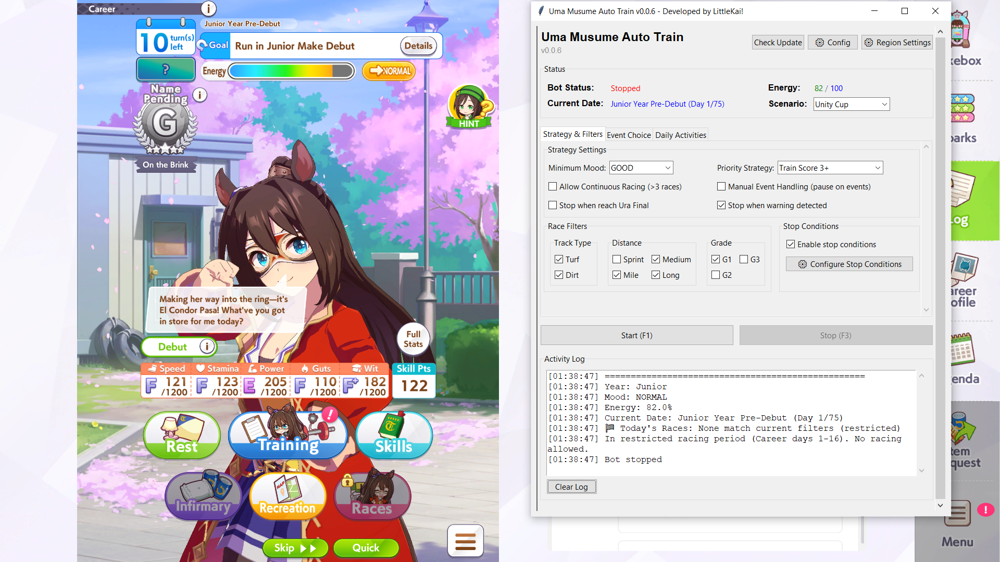
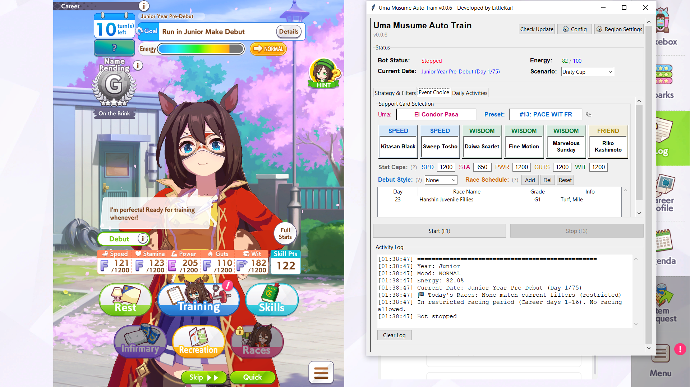

# Uma Musume Auto Train

Automated training bot for **Uma Musume: Pretty Derby** on PC. Handles training, racing, events, and rest automatically.

## Requirements

- Windows 10/11 (64-bit)
- Screen resolution: **1920x1080**
- [Tesseract OCR](https://github.com/UB-Mannheim/tesseract/wiki) installed (default path: `C:\Program Files\Tesseract-OCR\`)
- Uma Musume running in **fullscreen**

## Setup

1. Download the latest release zip from [Releases](https://github.com/LittleKai/uma-auto-trainer/releases)
2. Extract to any folder
3. Install Tesseract OCR (check "Add to PATH" during install)
4. **Recommended:** Add the extracted folder to Windows Security exclusions
   > Windows Security > Virus & threat protection > Manage settings > Exclusions
5. In-game: turn off all **"Require Confirmation"** settings

## Usage

1. Open the game in fullscreen (1920x1080)
2. Run `Uma_Musume_Auto_Train.exe`
3. Configure settings in the GUI tabs
4. Navigate to the **career lobby** screen in-game
5. Press **F1** to start

| Key | Action |
|-----|--------|
| F1 | Start bot |
| F3 | Stop bot |
| F5 | Force exit |

## Configuration

### Strategy & Filters Tab

- **Priority Strategy** - Training score threshold or G1-only mode
- **Race Filters** - Track, distance, grade filters
- **Minimum Mood** - Auto-rest when mood drops below threshold
- **Stop Conditions** - Auto-stop triggers (infirmary, low mood, race day, etc.)

### Event Choice Tab

- **Uma Musume** - Select your character (auto-sets race filters)
- **Preset** - 20 save slots, each stores full configuration
- **Support Cards** - Select 6 support cards for event map matching
- **Stat Caps** - Training score penalty as stats approach cap
- **Debut Style** - Auto-select running style at debut race
- **Race Schedule** - Preferred races the bot will prioritize (resets on Uma change)

### Daily Activities Tab

- Team Trial, Champion Meeting, Legend Race automation

## How It Works

Each turn the bot:
1. Reads game state via OCR (date, mood, energy, training options)
2. Checks for preferred scheduled races
3. Scores each training option based on support cards, stats, energy
4. Picks the best action: train, race, or rest

## Troubleshooting

| Problem | Solution |
|---------|----------|
| OCR fails | Check resolution is 1920x1080 fullscreen. Use Region Settings to adjust |
| Window not detected | Game title must contain "Umamusume" |
| Bot stuck | Check logs. Verify Tesseract is installed. Press F3 to stop |
| Inaccurate training | Adjust stat caps and priority strategy |

## Notes

- The `assets/` folder must stay next to the `.exe`
- `bot_settings.json` is auto-generated on first run - safe to delete to reset
- Do not modify `config.json` unless you understand the scoring system
- The bot auto-saves all GUI settings

## License

This software is provided as-is without warranty.
